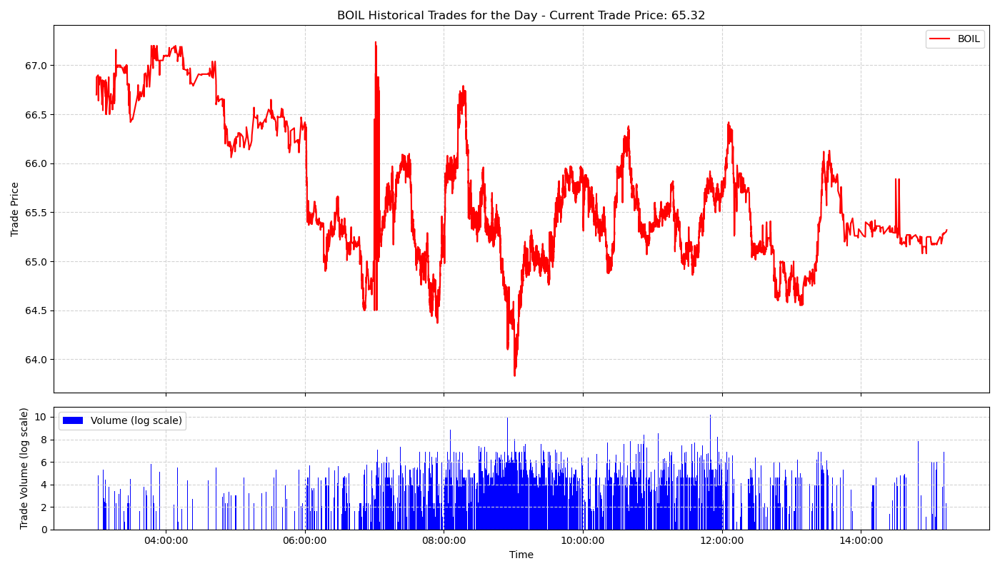

# Alpaca Real-time Trades Streamer

## Overview
The `alpaca_realtime_trades.py` is a Python program that streams real-time trade data from Alpaca for a specific stock symbol. It uses Alpaca's WebSockets API to subscribe to trade events for the specified symbol, and displays the real-time trade price and volume in a matplotlib plot. It leverages asyncio for the event loop and websockets for the connection to Alpaca's servers.

The program is designed with an `AlpacaStream` class, which is initialized with a stock symbol and uses environmental variables for the Alpaca API key and secret. The class maintains a matplotlib plot of trade prices and volumes, updates the plot when new trades occur, and handles incoming trade messages from the Alpaca WebSocket.

## Requirements
The following libraries are required to run this program:

- argparse
- asyncio
- websockets
- json
- matplotlib
- matplotlib.dates
- dateutil.parser
- tzlocal
- os

Please ensure that these libraries are installed in your Python environment. You can install any missing libraries with pip:

```
pip install argparse asyncio websockets json matplotlib dateutil tzlocal os
```

or 

```
pip install -r requirements.txt
```
## Usage

```
python alpaca_realtime_trades.py --symbol AAPL
```

Replace AAPL with the stock symbol you want to stream.

## Environment Variables

This application uses the following environment variables:

* APCA_API_KEY_ID: Your Alpaca API key
* APCA_API_SECRET_KEY: Your Alpaca secret key

These must be set in your environment variables prior to running the program.

## Features
Stream real-time trades from Alpaca
Display the streaming data (trade price and volume) for a specific stock symbol in real time.

## Example Trades plot:



## Disclaimer
This program does not provide investment advice. It simply streams trade data from Alpaca's API. Please invest responsibly.

## Contribution
Contributions are welcome. Please open a PR with any enhancements, fixes, or suggestions.
